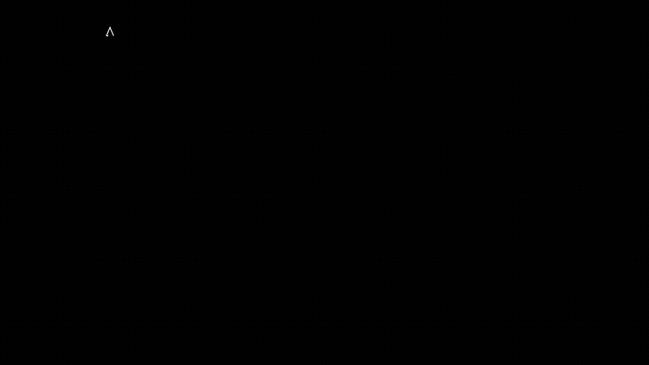

# manim-explainer

Short, 3Blue1Brown-style animated math explainers built on
[Manim Community](https://www.manim.community/) (ManimCE).

The aim is to reproduce Grant Sanderson's *visual grammar* — near-black stage, a
small cool-toned palette with a warm accent for the quantity under the spotlight,
equations animated in lockstep with the geometry they describe, and smooth
`Transform`s instead of hard cuts — on top of the better-documented, more stable
community engine rather than his personal `manimgl`.

## Demo: a square wave from spinning arrows



*One rotating vector becomes two, then many, chained tip-to-tip. The last tip's
height, carried sideways over time, draws the wave, and with odd harmonics
falling off like 1/n it converges to a square wave. Full-quality mp4:
[`examples/fourier_epicycles.mp4`](examples/fourier_epicycles.mp4).*

## Project layout

```
manim-explainer/
├── helpers.py          # shared palette, typography + reusable mobjects
├── manim.cfg           # project-wide render defaults (black bg, 60fps, media dir)
├── requirements.txt    # top-level dependency (manim==0.20.1)
├── requirements.lock   # exact frozen dependency set
├── scenes/
│   ├── fourier_epicycles.py  # the main explainer: square wave from rotating vectors
│   ├── hello.py              # smoke test (no LaTeX required)
│   └── latex_check.py        # smoke test that MathTex/LaTeX renders
├── examples/           # committed demo render (gif + mp4)
└── media/              # rendered output (git-ignored)
```

## Setup

Requires **Python 3.14** (pinned in `.python-version`), plus **ffmpeg** and a
**LaTeX** distribution.

> **Why 3.14 and not 3.13?** This machine's Homebrew `python@3.13` bottle has a
> mis-linked `pyexpat` (it resolves to the old system `libexpat.1.dylib`, which
> lacks a symbol the bottle was built against, so `pip` can't even bootstrap).
> Python 3.14 builds every native manim dependency (pycairo, moderngl,
> manimpango) cleanly and renders fine, so the project targets 3.14.

```bash
# 1. system deps (Homebrew)
brew install ffmpeg
brew install --cask basictex            # small LaTeX; needs admin password

# 2. LaTeX packages ManimCE needs (fresh terminal so tlmgr is on PATH)
sudo tlmgr update --self && sudo tlmgr install \
  amsmath babel-english cbfonts-fd cm-super count1to ctex doublestroke \
  dvisvgm everysel fontspec frcursive fundus-calligra gnu-freefont jknapltx \
  latex-bin mathastext microtype multitoc physics preview prelim2e ragged2e \
  relsize rsfs setspace standalone tipa wasy wasysym xcolor xetex xkeyval

# 3. Python env
python3.14 -m venv .venv
./.venv/bin/pip install -r requirements.txt
```

## Rendering

Run from the project root so `manim.cfg` is picked up:

A LaTeX distribution is only found on `PATH` in a fresh login shell; if `manim`
can't find `latex`, prepend the TeX bin dir: `export PATH="/Library/TeX/texbin:$PATH"`.

```bash
# the main Fourier scene, final quality (1080p, 60fps)
./.venv/bin/manim -qh scenes/fourier_epicycles.py FourierEpicycles

# quick preview of any scene (low quality, -p opens it when done)
./.venv/bin/manim -pql scenes/hello.py HelloScene

# quality flags: -ql (480p) · -qm (720p) · -qh (1080p) · -qk (4k)
```

Output mp4s land under `media/videos/<scene-file>/<resolution>/`.

## The Fourier scene (topic + how to swap it)

`scenes/fourier_epicycles.py` teaches a **Fourier series** by building a square
wave from rotating vectors (epicycles): intuition first (one vector, then a
chain), the traced wave as the payoff, and the equation
`f(θ) = (4/π) Σ sin((2k+1)θ)/(2k+1)` revealed last with each term color-matched
to its vector. The code is split into narrated beat-methods
(`one_vector`, `add_more_vectors`, `draw_the_wave`, `reveal_equation`).

**To animate a different target function**, change two knobs at the top of the
file: `freq(k)` (which harmonics) and `amp(k)` (their coefficients), plus
`N_FULL` (how many to sum). For example, a sawtooth uses *all* harmonics with
alternating-sign `1/n` coefficients. The reference curve in
`square_wave_reference()` is what the partial sums are drawn against; update it
to match the new target.

## Extending with new scenes

1. Add a file under `scenes/`, e.g. `scenes/my_topic.py`.
2. Start it with the same 3 lines every scene here uses so it can import the
   shared style from the project root:
   ```python
   import sys; from pathlib import Path
   sys.path.append(str(Path(__file__).resolve().parent.parent))
   from helpers import PALETTE, title_text, labeled_equation
   ```
3. Subclass `Scene`, put the animation in `construct()`, and reuse `PALETTE`
   (`structure`/`wave`/`sum`/`accent`) so new scenes stay visually consistent.
4. Render with `manim -pql scenes/my_topic.py MySceneClass`.
